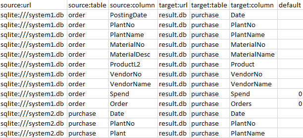

# Gramex Data Connectors Merge Demo

Gramex can connect to multiple data sources, merge data, create a single dataset, and render it visually.

This demo is an example of how it does it. You can try it on the [Gramex IDE](https://gramex.gramener.com/).

## We have two purchase databases

1. [`system1.db`](system1.db) has an `order` table with 11 columns.

   

2. [`system2.db`](system2.db) has a `purchase` table with 14 columns.

   

You can download these databases and view them at <https://inloop.github.io/sqlite-viewer/>.

## We want to merge their contents

Both databases have purchase data from a system such as SAP. But the structures are slightly different. For example:

- `system1.db` uses a table called `order`. `system2.db` calls it `purchase`
- `system1.db` uses a `PostedDate` column. `system2.db` calls it `Date`
- `system1.db` has an `Order` column with the order number. It is missing in `system2.db`

We want to merge these into a single table that merges relevant columns, transforming them slightly different structure.

## Gramex supports mappings to merge data

The mapping is a table that you can save in a database or a file. Here is an example:

The mapping has these columns:

- `target:url`: where you want to store the results. This could be a database or file
- `source:url`: which database/file to get data from
- `source:table`: which table to get data from
- `column`: which column to get data from
- `target`: which column to map it to in the target
- `default`: if a value is missing, what to fill it with

For example,, the first row:

- ... from `sqlite:///system1.db` -- i.e. a SQLite database
- ... from the `order` table
- ... from the column `PostingDate`
- ... into the database `sqlite:///result.db` -- i.e. SQLite database
- ... into the `purchase` table
- ... into the column `Date`
- ... with no default value to be set

The [result](result) looks like this:

## Mappings can be scheduled or triggered

Using [Gramex schedulers](https://learn.gramener.com/guide/scheduler/), this process can be run at specific times or based on triggers.

You can also manually trigger it. Change the [mapping](mapping) and click "Merge" below to refresh the data.

<!-- markdownlint-disable MD033 -->
<a href="merge" class="btn btn-large btn-primary">Merge</a>

This is the underlying approach used in the [Gramex Purchase app](https://gramener.com/purchase/), which merged data across multiple plants' purchase data.

